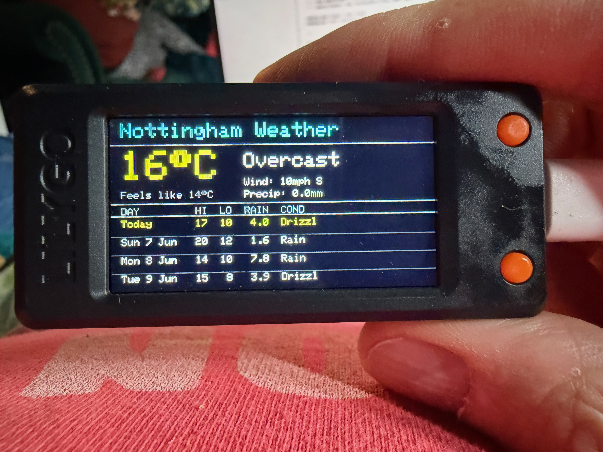
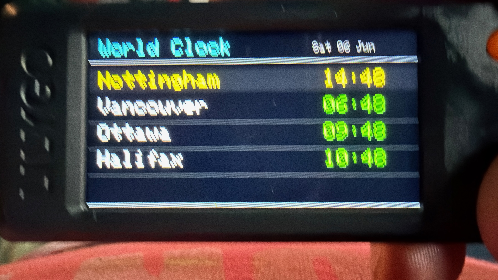
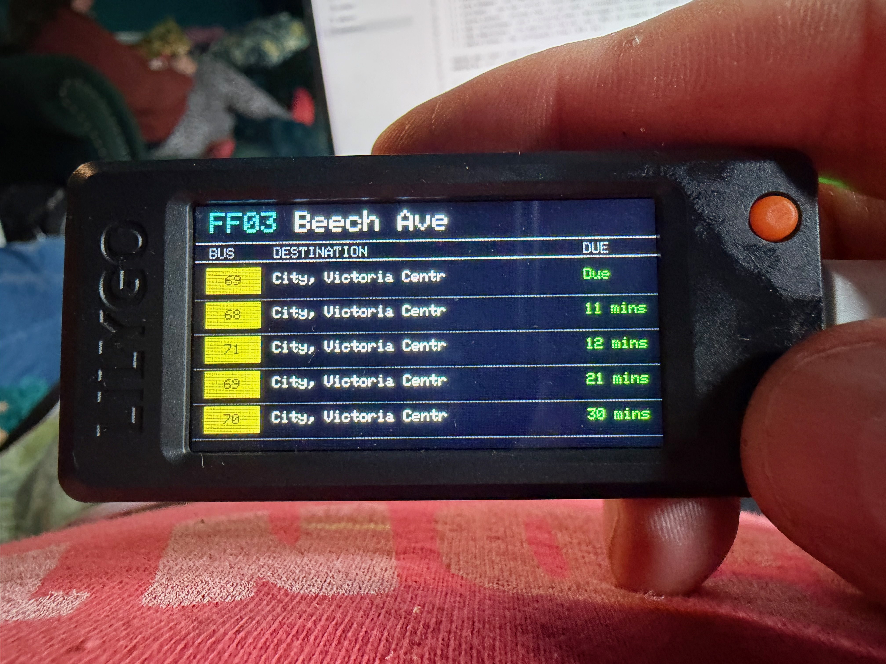
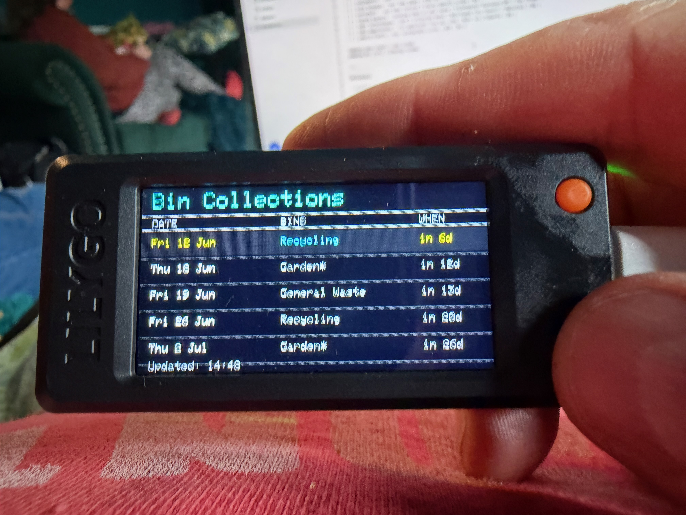
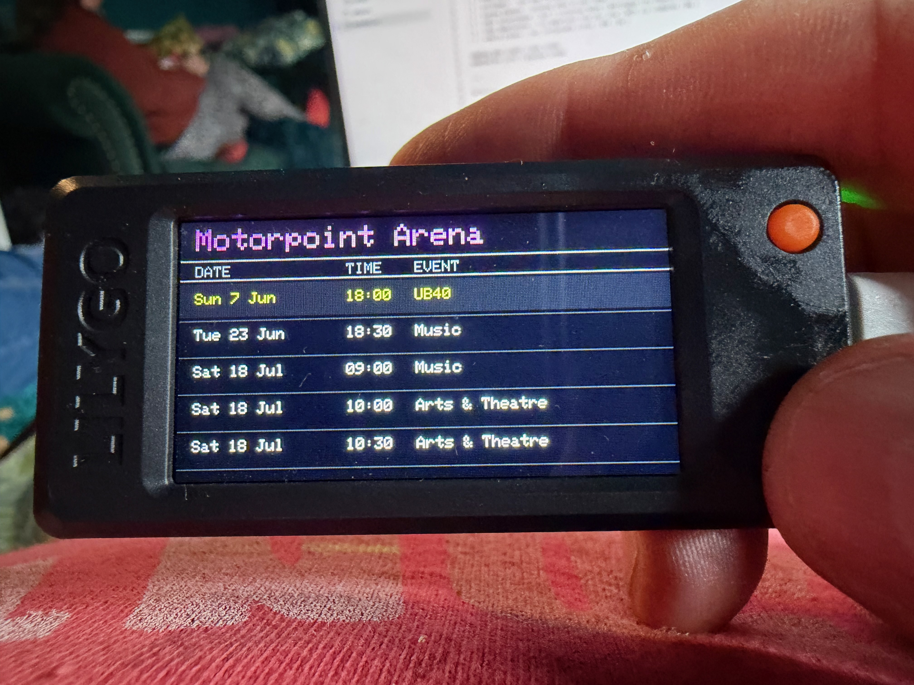
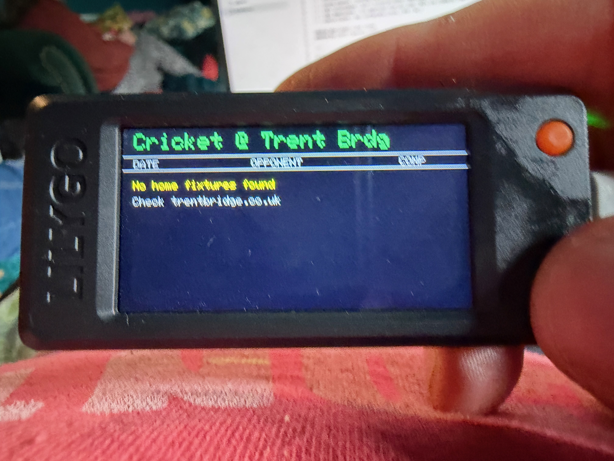
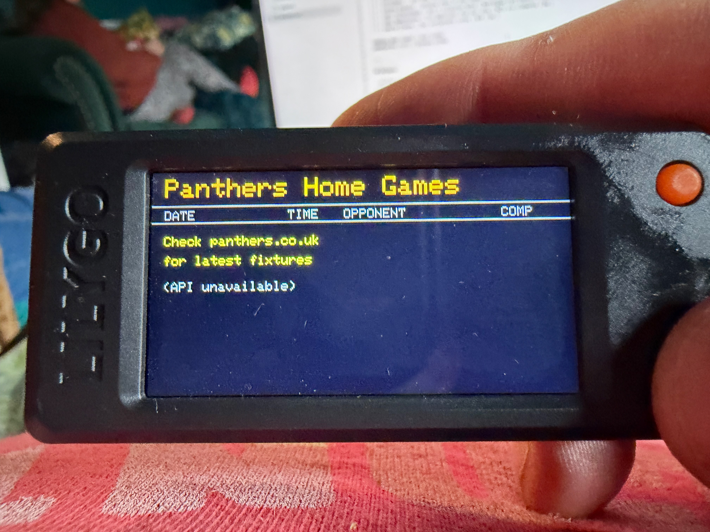
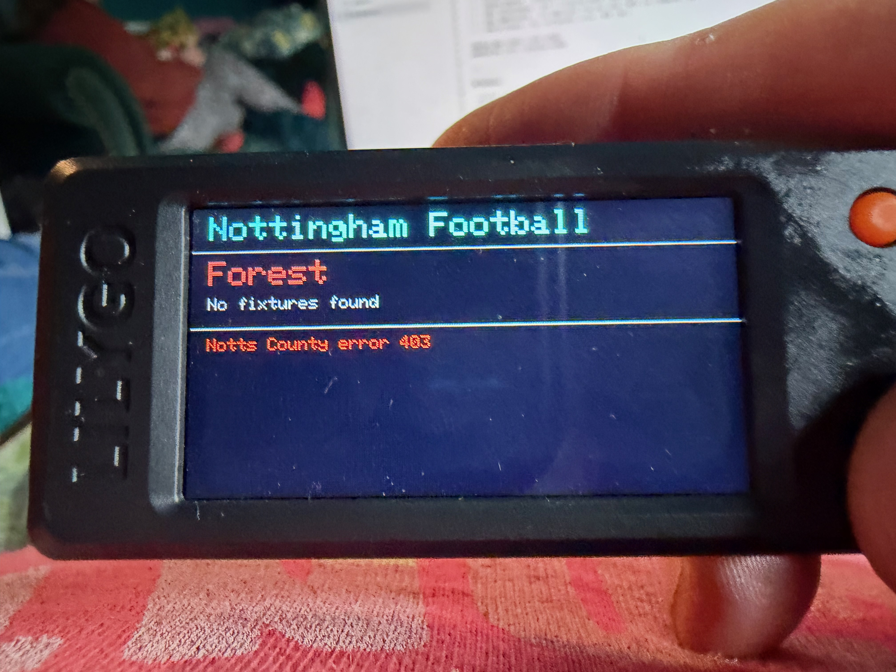

# The Nottinghamer

A local information display for the **LilyGO T-Display S3** (ESP32-S3). Eight screens of local information cycled with two buttons.


---

## Screens

| # | Screen | Data Source | API Key? |
|---|--------|------------|----------|
| 0 | **Weather** — current conditions + 4-day forecast | Open-Meteo | No |
| 1 | **Football** — next 3 fixtures for two teams | football-data.org | Yes (free) |
| 2 | **Ice Hockey** — next home games | EIHL API | No |
| 3 | **Cricket** — next home fixtures | County website scrape | No |
| 4 | **Arena Events** — upcoming shows at your venue | Ticketmaster Discovery API | Yes (free) |
| 5 | **Bin Collections** — next 5 collection dates | Nottingham City Council / ReCollect | No |
| 6 | **Bus Departures** — live departures from your stop | NCTx via crudworks | No |
| 7 | **World Clock** — four configurable cities | NTP | No |

**Button 14** (right) = next screen  
**Button 0** (left) = previous screen

---
## Hardware

- **LilyGO T-Display S3** — [LilyGO on AliExpress](https://www.aliexpress.com/item/1005004496543604.html) or the [LilyGO GitHub](https://github.com/Xinyuan-LilyGO/T-Display-S3)
- USB-C cable for programming
- WiFi network (2.4GHz)

---

## Software Setup

### 1. Arduino IDE

Install [Arduino IDE 2.x](https://www.arduino.cc/en/software).

### 2. ESP32 Board Package

In Arduino IDE go to **File → Preferences** and add this URL to Additional Board Manager URLs:

```
https://raw.githubusercontent.com/espressif/arduino-esp32/gh-pages/package_esp32_index.json
```

Then go to **Tools → Board → Boards Manager**, search for `esp32` and install version **2.0.14**.

> ⚠️ Version 2.0.14 specifically — newer versions have compatibility issues with the T-Display S3.

### 3. TFT_eSPI Library

Download the LilyGO version of TFT_eSPI (not the Library Manager version):

1. Go to [https://github.com/Xinyuan-LilyGO/T-Display-S3](https://github.com/Xinyuan-LilyGO/T-Display-S3)
2. Download the repo as a ZIP
3. Copy the `TFT_eSPI` folder from the repo into your Arduino libraries folder (`~/Documents/Arduino/libraries/`)
4. Delete any existing TFT_eSPI folder first if one exists

### 4. ArduinoJson Library

In Arduino IDE go to **Tools → Manage Libraries**, search for `ArduinoJson` and install version **7.x** by Benoit Blanchon.

### 5. Board Settings

In Arduino IDE select:

- **Board**: ESP32S3 Dev Module
- **Upload Speed**: 921600
- **USB Mode**: Hardware CDC and OTG
- **USB CDC On Boot**: Enabled
- **Flash Mode**: QIO 80MHz
- **Flash Size**: 16MB (128Mb)
- **Partition Scheme**: 16M Flash (3MB APP/9.9MB FATFS)
- **PSRAM**: OPI PSRAM
- **Port**: whichever port appears when you plug in the device

---

## Configuration

Open `config.h` and fill in all the values. Each section has instructions. Here's what you need for each data source:

---

### Weather — Open-Meteo (no account needed)

Just set your latitude and longitude in `config.h`. Find your coordinates at [latlong.net](https://www.latlong.net).

```cpp
#define WEATHER_LAT        52.9548f
#define WEATHER_LON        -1.1581f
#define WEATHER_CITY_NAME  "Nottingham"
```

---

### Football — football-data.org

1. Register for a free account at [football-data.org/client/register](https://www.football-data.org/client/register)
2. You'll receive an API key by email
3. Paste it into `config.h`

To find your team IDs, browse to:
```
https://api.football-data.org/v4/competitions/PL/teams
```
(replace `PL` with your competition code). Or search the [documentation](https://www.football-data.org/documentation/quickstart).

Common team IDs:

| Team | ID |
|------|----|
| Nottingham Forest | 67 |
| Notts County | 345 |
| Arsenal | 57 |
| Chelsea | 61 |
| Liverpool | 64 |
| Manchester City | 65 |
| Manchester United | 66 |
| Tottenham | 73 |
| Aston Villa | 58 |
| Leeds United | 341 |

```cpp
#define FOOTBALL_API_KEY    "your-key-here"
#define FOOTBALL_TEAM1_ID   67
#define FOOTBALL_TEAM1_NAME "Forest"
```

---

### Ice Hockey — EIHL (no account needed)

The EIHL API is public. Set your team ID and the current season ID.

| Team | ID |
|------|----|
| Nottingham Panthers | 12 |
| Sheffield Steelers | 2 |
| Cardiff Devils | 1 |
| Belfast Giants | 3 |
| Dundee Stars | 5 |
| Fife Flyers | 6 |
| Glasgow Clan | 7 |
| Guildford Flames | 8 |
| Manchester Storm | 9 |

The season ID increments each year — check `eliteleague.co.uk` if fixtures aren't showing; the current season may have a new ID.

```cpp
#define EIHL_TEAM_ID     "12"
#define EIHL_SEASON_ID   "36"
#define EIHL_TEAM_SHORT  "NOT"
```

---

### Cricket — website scraper (no account needed)

The sketch scrapes your county cricket club's fixtures page looking for home matches. Set the URL and the venue name text that appears on the page.

```cpp
#define CRICKET_FIXTURES_URL "https://www.trentbridge.co.uk/cricket/first-xi-fixtures.html"
#define CRICKET_VENUE_NAME   "Trent Bridge"
#define CRICKET_VENUE_ALT    "trent-bridge"
```

If your county's website has a different structure the scraper may not find fixtures — check the page source and look for `datetime="20` date attributes near the fixture details.

---

### Arena Events — Ticketmaster (free account)

1. Register at [developer.ticketmaster.com](https://developer.ticketmaster.com)
2. Create an app — you'll get a **Consumer Key** (that's your API key)
3. Find your venue ID by searching:
   ```
   https://app.ticketmaster.com/discovery/v2/venues.json?keyword=YOUR+VENUE&countryCode=GB&apikey=YOUR_KEY
   ```
   Look for the `"id"` field in the response — it'll be something like `KovZ9177tQ7`.

```cpp
#define TICKETMASTER_KEY      "your-consumer-key"
#define TICKETMASTER_VENUE_ID "KovZ9177tQ7"
#define ARENA_NAME            "Motorpoint Arena"
```

---

### Bin Collections — Nottingham City Council (no account needed)

This works for addresses covered by **Nottingham City Council**. Other councils may use different systems.

**Finding your Place ID:**

1. Go to [nottinghamcity.gov.uk/binreminders](https://www.nottinghamcity.gov.uk/binreminders)
2. Enter your postcode and select your address
3. Open browser DevTools — press **F12**
4. Go to the **Network** tab
5. Look for a request to `api.eu.recollect.net`
6. Your Place ID is the UUID in the URL path — it looks like `CA0889C8-DBFF-11EE-96DB-AC388EA0F4B8`

```cpp
#define BINS_PLACE_ID   "YOUR-UUID-HERE"
#define BINS_SERVICE_ID "50003"
```

> The Service ID `50003` is fixed for Nottingham. If you're using a different ReCollect-powered council service, find your Service ID the same way as the Place ID.

---

### Bus Departures — NCTx (no account needed)

This uses [Simon Prickett's](https://simonprickett.dev) free Cloudflare Worker which wraps the Nottingham City Transport live departures API. It only works for **NCTx buses in Nottingham**.

**Finding your Stop ID (ATCO code):**

1. Go to [bustimes.org](https://bustimes.org) or [traveline.info](https://www.traveline.info)
2. Search for your bus stop by name or postcode
3. Click on the stop — the ATCO code is shown in the stop details
4. It looks like `3390FF03` — an 8-character alphanumeric code

```cpp
#define BUS_STOP_ID   "3390FF03"
#define BUS_STOP_NAME "Beech Ave"
```

> If you're outside Nottingham, this screen won't work as-is — the crudworks worker only covers NCTx. For other operators, you'd need a different data source.

---

### World Clock (no account needed)

The clock uses NTP to get accurate UTC time, then applies manual UTC offsets for each city. No external API calls after boot.

Configure four cities in `config.h`. City 1 is highlighted as your home city.

UTC offset reference (in minutes):

| City | Standard | DST |
|------|----------|-----|
| London | 0 | +60 |
| Paris / Berlin / Madrid | +60 | +120 |
| Dubai | +240 | +240 |
| Riyadh | +180 | +180 |
| New York / Ottawa | -300 | -240 |
| Chicago | -360 | -300 |
| Denver / Calgary | -420 | -360 |
| Los Angeles / Vancouver | -480 | -420 |
| Halifax | -240 | -180 |
| Singapore | +480 | +480 |
| Sydney | +600 | +660 |

Set `DST_START=0` and `DST_END=0` to disable DST for cities that don't observe it.

---

## Uploading

1. Plug in the T-Display S3 via USB-C
2. Hold the **BOOT** button on the device while clicking Upload in Arduino IDE
3. Release BOOT once the upload starts
4. The device will restart and show "The Nottinghamer / Connecting..."

If the port doesn't appear, you may need the [CP210x driver](https://www.silabs.com/developers/usb-to-uart-bridge-vcp-drivers).

---

## Troubleshooting

**Blank screen / not starting**  
Check the board settings match those listed above, particularly the partition scheme and PSRAM setting.

**WiFi not connecting**  
Double-check SSID and password in `config.h`. The T-Display S3 only supports 2.4GHz networks.

**Football showing error**  
Check your API key. The free tier of football-data.org rate-limits to 10 requests per minute — this is fine for normal use but may cause issues if you restart frequently.

**Bus screen not working**  
Confirm your stop ID is an NCTx stop. Check [bustimes.org](https://bustimes.org) to verify the stop ATCO code.

**Cricket showing no fixtures**  
The scraper depends on the structure of the county website. If the site has been redesigned it may stop working. Check the Serial Monitor (115200 baud) for HTTP status codes.

**Bins showing error**  
Your Place ID may have changed, or the ReCollect API may be temporarily unavailable. Re-find your Place ID using the DevTools method above.

**Clock showing wrong times**  
Check the UTC offsets in `config.h`. Remember to account for DST — the sketch handles transitions automatically based on the month, but the offsets need to be set correctly for both standard and DST periods.

---

## Serial Monitor

Connect at **115200 baud** to see debug output. Each data fetch logs the HTTP status code and a snippet of the response, which is useful for diagnosing issues.

---

## Adapting for Other Cities

The Nottinghamer is designed for Nottingham but most screens are configurable:

- **Weather**: any location — just change the coordinates
- **Football**: any club on football-data.org
- **Ice Hockey**: any EIHL team
- **Cricket**: any county with a scrapable fixtures page
- **Arena**: any Ticketmaster venue
- **Bins**: any address covered by a ReCollect-powered council
- **Bus**: NCTx Nottingham only (would need code changes for other operators)
- **Clock**: any four cities

---

## The Nottinghamer in Action










---

## Credits

- [Simon Prickett](https://simonprickett.dev) — NCTx Cloudflare Worker at `nctx.crudworks.workers.dev`
- [Open-Meteo](https://open-meteo.com) — free weather API
- [football-data.org](https://www.football-data.org) — football fixtures API
- [EIHL](https://www.eliteleague.co.uk) — ice hockey schedule API
- [Ticketmaster](https://developer.ticketmaster.com) — events API
- [ReCollect](https://recollect.net) — bin collection data
- [LilyGO](https://github.com/Xinyuan-LilyGO/T-Display-S3) — T-Display S3 hardware and TFT_eSPI library

---

## Licence

MIT — do what you like with it.
